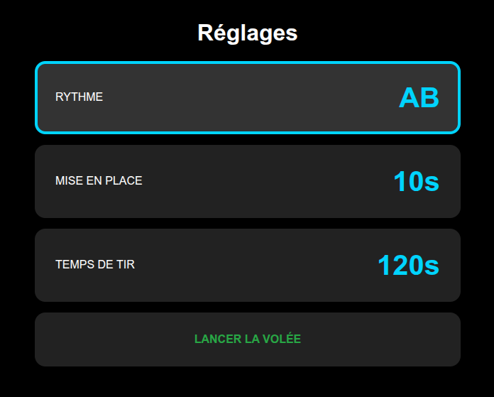
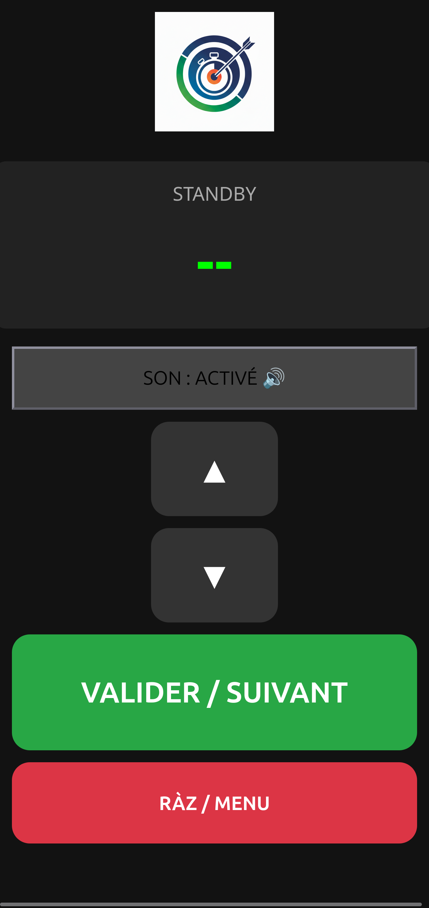
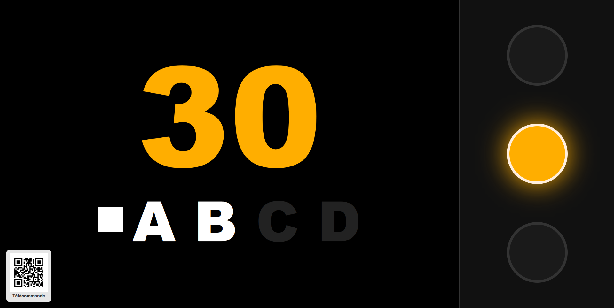

# Chrono

## Description du projet

Ce projet permet de mettre en place un système de chrono pour s'entraîner dans
des conditions assez proches d'un tir en salle (FFTA). Il n'a pas pour objectif
de remplacer le système [Chronotir](https://chronotir.fr/) ou
[ArcheryClock](https://www.archeryclock.com/).

## Matériel nécessaire

- Un Raspberry Pi 3 ou plus récent.
- Un écran.
- Un téléphone ou une tablette ou un pc ayant une connexion WiFi.

## Installation


```shell
# Mise à jour de l'OS
sudo apt update
sudo apt dist-upgrade

# Installation des paquets
sudo apt install -y vim docker.io unclutter git hostapd dnsmasq

# Récupération du projet
git clone <url> ~/chrono
cd ~/chrono

# Création du fichier de démarrage de l'affichage automatique
mkdir -p ~/.config/autostart
cp ~/chrono/configfiles/display.desktop ~/.config/autostart/display.desktop

# Build de l'image docker en local
sudo docker build -t chrono .

# Démarrage de l'application
sudo docker run -d --restart=unless-stopped -p80:5000 -e HOST=0.0.0.0 --name chrono chrono

# Configuration du hotspot
sudo cp ~/chrono/configfiles/dhcpcd.conf /etc/dhcpcd.conf
sudo mkdir /etc/network/interfaces.d
sudo cp ~/chrono/configfiles/wlan0 /etc/network/interfaces.d/wlan0
sudo cp ~/chrono/configfiles/hostapd.conf /etc/hostapd/hostapd.conf
sudo cp ~/chrono/configfiles/hostapd /etc/default/hostapd
sudo cp ~/chrono/configfiles/dnsmasq.conf /etc/dnsmasq.conf
sudo cp ~/chrono/configfiles/NetworkManager.conf/etc/NetworkManager/NetworkManager.conf
sudo systemctl unmask hostapd
sudo systemctl enable hostapd
sudo systemctl enable dnsmasq

# Un peu de ménage
sudo apt autoremove
sudo apt clean
sudo apt autoclean
sudo rm -rf /var/lib/apt/lists/*

sudo reboot
```

## Utilisation

Une fois démarré, le raspberry va afficher l'écran avec la page de
configuration. Il faut alors se connecter en wifi avec un autre périphérique
sur le wifi `CHRONO`, avec le mot de passe défini dans le fichier
[./configfiles/hostapd.conf](./configfiles/hostapd.conf) (`secret_password` par
défaut).

Ouvrez un navigateur et rendez-vous sur <http://chrono.local>. Ensuite laissez-vous guider pour paramétrer votre séance, c'est très intuitif !

## Captures

<div style="text-align:center">







</div>

## Licence

Ce projet est publié sous licence GNU Affero General Public License v3.
